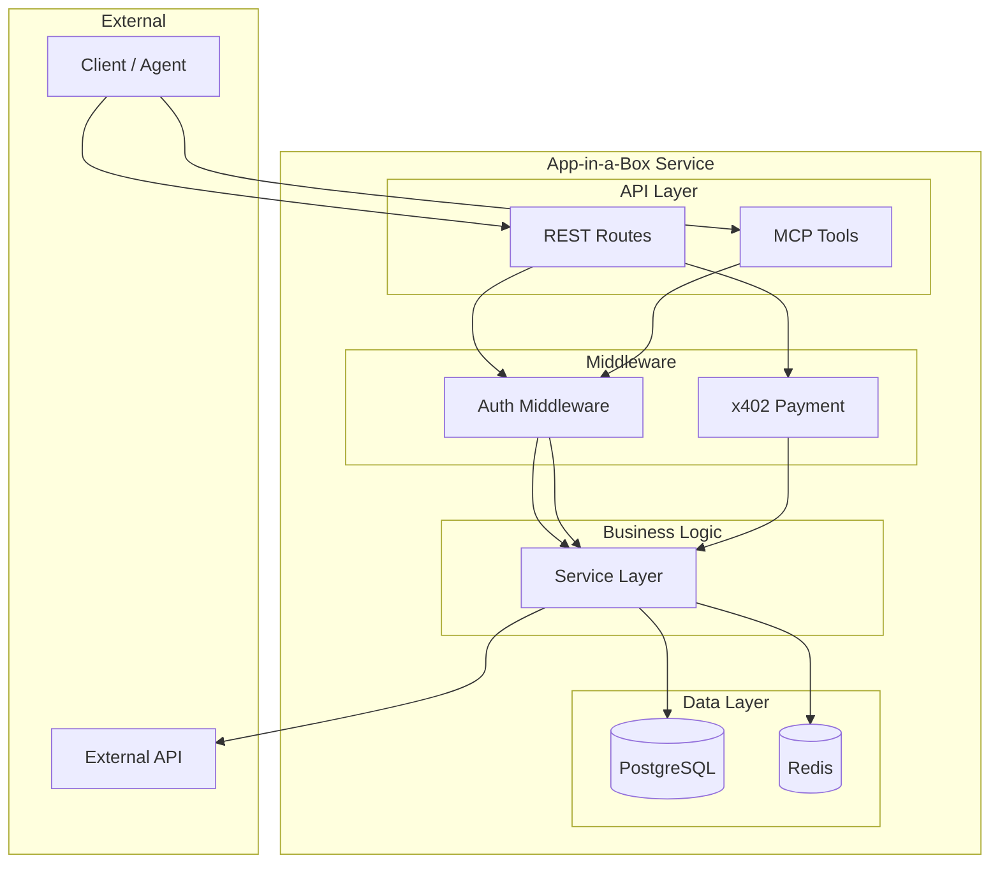
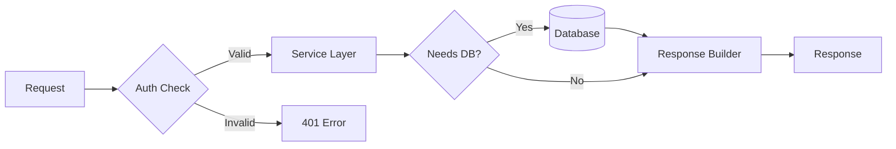
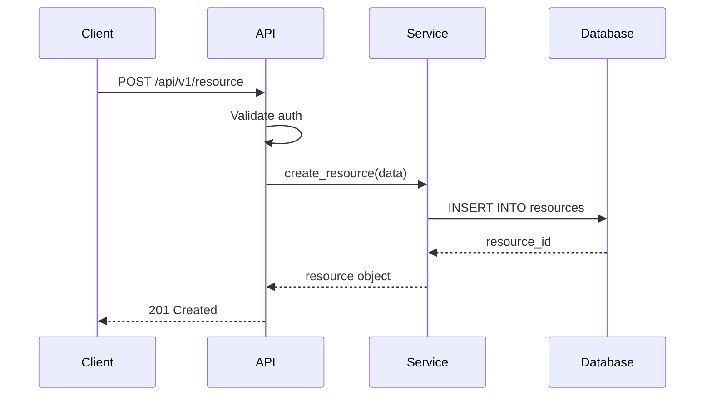
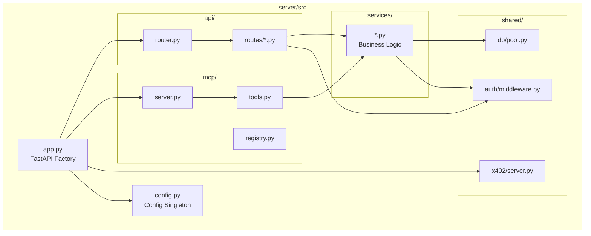

# Architecture Design

Design the system architecture from the approved specification. Generate comprehensive mermaid diagrams and determine which server modules to keep or remove.

**Announce at start:** "I'm designing the system architecture based on your specification. I'll create diagrams showing how everything fits together, and determine which parts of the template your project actually needs."

## Inputs

Read these files (all required):
- `docs/specification.md` — approved technical specification
- `docs/requirements.md` — approved requirements for context
- `CLAUDE.md` — project context
- `branding.json` — project identity

If `docs/specification.md` doesn't exist or isn't approved, tell the user to run `/specification` first.

## Process

### Step 1: Analyze Specification

From the spec, identify:
- **Components:** What logical pieces make up the system? (API layer, service layer, data layer, external integrations, auth, payments)
- **Boundaries:** What's inside vs outside the system?
- **Data stores:** What databases, caches, or file stores are needed?
- **Communication patterns:** Sync (HTTP/REST) vs async (queues, events)?
- **External dependencies:** What third-party services?

### Step 2: Generate System Architecture Diagram



Customize this based on what the spec actually needs. Remove components that aren't required.

### Step 3: Generate Data Flow Diagram

Show how data moves through the system for the primary use cases. Use `flowchart LR` (left-to-right) for data flows:



Create one data flow diagram per major interaction pattern identified in the spec.

### Step 4: Generate Sequence Diagrams

For each complex interaction (multi-step flows, external API calls, payment flows), create a sequence diagram:



Generate at least one sequence diagram for:
- The primary CRUD flow
- Any payment flow (if x402 is used)
- Any external integration flow
- Any multi-step workflow

### Step 5: Generate Component Diagram

Show the internal structure of the server/ directory as components:



### Step 6: Generate Folder/File Hierarchy

Create a complete tree of the project structure with annotations:

```
app-in-a-box/
├── .claude/                    # Development framework
│   ├── agents/
│   │   └── product-owner.md   # Drives implementation after /plan
│   ├── rules/
│   │   └── git-workflow.md
│   └── skills/
│       ├── onboard/SKILL.md
│       ├── requirements/SKILL.md
│       ├── specification/SKILL.md
│       ├── architecture/SKILL.md
│       ├── plan/SKILL.md
│       └── tutorial/SKILL.md
├── server/
│   ├── src/
│   │   ├── app.py             # {annotation}
│   │   ├── config.py          # {annotation}
│   │   ├── api/routes/        # {annotation for each route file}
│   │   ├── mcp/               # {annotation}
│   │   ├── services/          # {annotation for each service}
│   │   └── shared/            # {annotation}
│   ├── tests/                 # {annotation}
│   └── ...
├── plugin/                    # {annotation}
├── tutorials/                 # {annotation}
├── docs/                      # {annotation}
├── assets/                    # {annotation}
└── ...
```

Include EVERY file that will exist after implementation, with a brief annotation explaining its purpose.

### Step 7: Determine Module Retention

Based on the architecture, determine which server modules are needed:

| Module | Keep? | Reason |
|--------|-------|--------|
| PostgreSQL | Yes/No | {Why} |
| Redis | Yes/No | {Why} |
| x402 payments | Yes/No | {Why} |
| MCP tools | Yes/No | {Why} |
| API key auth | Yes/No | {Why} |
| Terraform (GCP) | Yes/No | {Why} |

Present this as:

> "Based on your architecture, here's what your project needs and what we can remove:"
> - **Keeping:** {list with brief reasons}
> - **Removing:** {list with brief reasons}
> "Does this look right?"

This is the subtractive setup decision — it informs the scaffold cleanup step in the implementation plan.

### Step 8: Present to User

Present all diagrams and the module retention table. Walk through each diagram:

> "Here's the system architecture. Let me walk you through it..."

For each diagram, explain what it shows and why it's structured that way. Adapt to experience level:

- **Beginner:** "This box represents your API — it's where other apps talk to yours. The arrow going to the database means..."
- **Intermediate:** "The service layer sits between routes and data — this keeps business logic testable without HTTP."
- **Advanced:** Present the diagrams and focus on trade-offs and alternatives.

### Step 9: Write Architecture Document

When the user approves, write `docs/architecture.md`:

```markdown
# Architecture: {Project Name}

**Generated:** {date}
**Status:** Approved
**Based on:** docs/specification.md

## System Architecture

{System architecture mermaid diagram}

{Explanation of components and their responsibilities}

## Data Flow

{Data flow diagrams for each major pattern}

{Explanation of how data moves through the system}

## Sequence Diagrams

{Sequence diagram for each complex interaction}

{Explanation of multi-step flows}

## Component Structure

{Component diagram}

{Explanation of internal module structure}

## Project Structure

{Folder/file hierarchy tree with annotations}

## Module Decisions

| Module | Status | Reason |
|--------|--------|--------|
{Table of keep/remove decisions}

## Technology Choices

{Rationale for key technology decisions}

## Deployment Architecture

{How the system is deployed — Docker, Cloud Run, etc.}
```

## Gate

After writing the document:

> "Architecture written to `docs/architecture.md`. Please review the diagrams and module decisions. When you approve, I'll create the implementation plan."
>
> "Say 'approved' to proceed to /plan, or tell me what to change."

Wait for explicit approval.

## Hand Off

When approved, invoke the `/plan` skill.

## Re-entry

If `docs/architecture.md` already exists:

> "I see an existing architecture. Do you want to revise it or regenerate from the current specification?"

## Notes

- Every diagram should be self-explanatory. A developer should be able to understand the system from the diagrams alone.
- The folder/file hierarchy is critical — it locks in the decomposition decisions that the implementation plan builds on.
- Module retention decisions must be justified. Don't remove something just because the user didn't explicitly mention it — remove it because the architecture doesn't need it.
- Use the existing x402-app-template structure as the baseline. Only deviate when the spec requires it.
