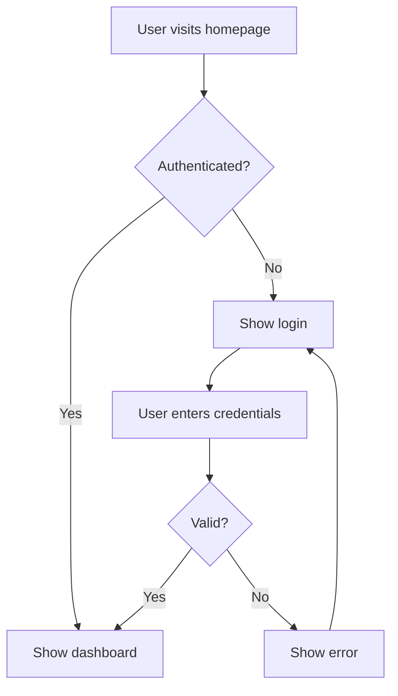

# Requirements Gathering

Elicit what the app needs to do through conversation, produce user stories and flow diagrams, and write a requirements document.

**Announce at start:** "I'm going to help you define what your app needs to do. We'll work through this together and I'll create user flow diagrams so you can visually verify everything makes sense."

## Inputs

Read these files for context (if they exist):
- `CLAUDE.md` — project context from onboarding (what, why, experience level)
- `branding.json` — project name and identity

If neither exists, ask the user to describe their project first.

## Process

### Step 1: Understand the Domain

Start from the project description in CLAUDE.md. Ask clarifying questions **one at a time** to understand:

- Who are the users? (Can be humans, agents, or both)
- What are the core actions users take?
- What data does the system manage?
- What external systems does it interact with?
- What are the constraints? (Performance, cost, compliance, etc.)

Adapt your language to the user's experience level:
- **Beginner:** "What should someone be able to do with your app?"
- **Intermediate:** "Let's map out the main user actions and data flows."
- **Advanced:** "What are the core use cases and system boundaries?"

### Step 2: Draft User Stories

From the conversation, draft user stories in this format:

```
As a [role], I want to [action] so that [benefit].

Acceptance criteria:
- [ ] [Specific testable criterion]
- [ ] [Specific testable criterion]
```

Group stories by feature area. Present them to the user:

> "Here are the user stories I've captured. Review these and let me know if anything is missing or wrong."

Iterate until the user is satisfied.

### Step 3: Generate User Flow Diagrams

Generate **at least 3 mermaid flowchart diagrams** that together cover **95% of the use cases** described in the user stories. Each diagram should cover a major user journey.

**Diagram guidelines:**
- Use `flowchart TD` (top-down) for user flows
- Include decision points (diamond nodes) for branching logic
- Label all edges with conditions or actions
- Start each flow from a clear entry point (e.g., "User opens app", "Agent calls API")
- End each flow at a clear outcome (success state, error state, or redirect)
- Keep each diagram focused on one journey — don't cram everything into one chart

**Example structure:**

~~~markdown
### User Flow 1: [Flow Name]



**Covers user stories:** US-1, US-3, US-7
~~~

Present all diagrams to the user:

> "I've created [N] user flow diagrams that cover the main paths through your app. Review these carefully — they're the best way to catch anything we've missed. Do these flows match how you see the app working?"

**This is the primary validation tool.** Encourage the user to study the diagrams. Most discrepancies between what the user wants and what we've captured will show up here.

### Step 4: Identify Gaps

After the user reviews the diagrams, ask:

> "Is there any situation or edge case these flows don't cover that you think is important?"

If the user identifies gaps, update the stories and diagrams, then re-present.

### Step 5: Write Requirements Document

When the user approves the stories and diagrams, write `docs/requirements.md`:

```markdown
# Requirements: {Project Name}

**Generated:** {date}
**Status:** Approved

## Project Overview

{Brief description from onboarding}

## Users

{Who uses this system and how}

## User Stories

### {Feature Area 1}

{User stories with acceptance criteria}

### {Feature Area 2}

{User stories with acceptance criteria}

## User Flow Diagrams

### Flow 1: {Name}

{Mermaid diagram}

**Covers:** {Which user stories}

### Flow 2: {Name}

{Mermaid diagram}

**Covers:** {Which user stories}

### Flow 3: {Name}

{Mermaid diagram}

**Covers:** {Which user stories}

## Constraints

{Performance, cost, compliance, technical constraints}

## Out of Scope

{What this version explicitly does NOT include}
```

## Gate

After writing the document:

> "Requirements are written to `docs/requirements.md`. Please review the document. When you approve, we'll move to the technical specification phase."
>
> "Say 'approved' to proceed to /specification, or tell me what to change."

Wait for explicit approval. Do not proceed without it.

## Hand Off

When approved, invoke the `/specification` skill.

## Re-entry

This skill can be run again at any time. If `docs/requirements.md` already exists, read it first and ask:

> "I see existing requirements. Do you want to revise them or start fresh?"

If revising, show the current stories and diagrams and ask what changed.

## Notes

- One question at a time. Never batch.
- The user flow diagrams are the most important output. They catch misunderstandings that text alone misses.
- 95% coverage means the main paths AND the most important error/edge cases. Not every conceivable edge case.
- If the user's project is simple (e.g., a single-purpose API), 3 diagrams may cover everything. If it's complex, generate more.
- Always include an "Out of Scope" section. This prevents scope creep during implementation.
