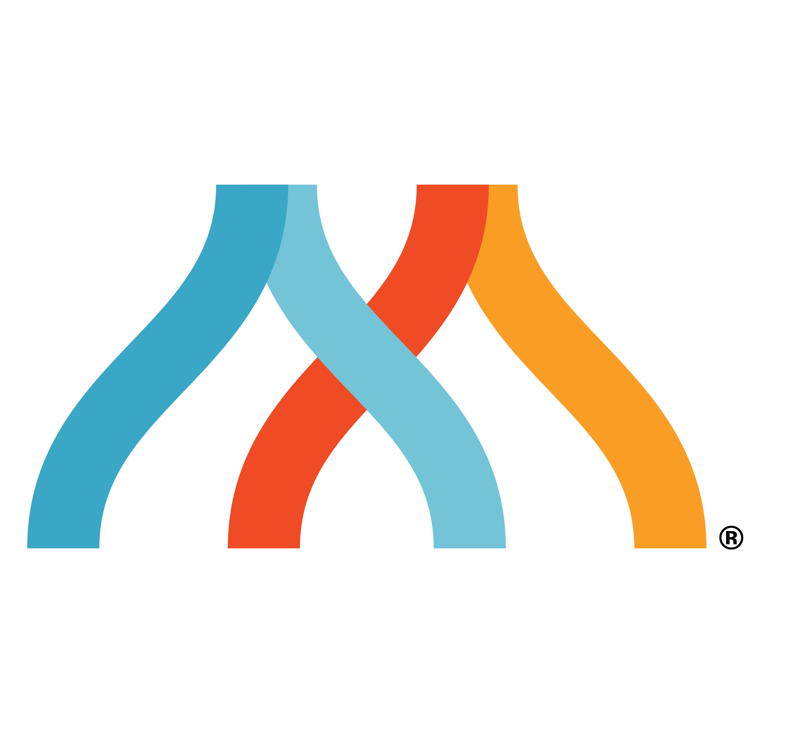

<div align="center">
  <a href="https://github.com/MangroveTechnologies/app-in-a-box">
    
  </a>

  <h1>App-in-a-Box</h1>

  <p>
    <strong>Ship faster with Claude Code.</strong><br>
    A general-purpose FastAPI + Claude Code development template by <a href="https://mangrovedeveloper.ai">Mangrove Technologies</a>.
  </p>

  <p>
    <a href="https://github.com/MangroveTechnologies/app-in-a-box/actions/workflows/ci.yml">
      
    </a>
    <a href="https://github.com/MangroveTechnologies/app-in-a-box/blob/main/LICENSE">
      
    </a>
  </p>
</div>

---

## What's in the Box

- **FastAPI** backend with REST + MCP dual protocol
- **Claude Code development framework** — 4-phase design lifecycle (requirements → spec → architecture → plan)
- **Agent-driven onboarding** — conversational setup that learns your project
- **Claude Code plugin** — ready-made plugin for your app's end users
- **Three-tier access control** — free, API key auth, x402 payment-gated
- **PostgreSQL + Redis** — optional, via Docker profiles
- **Docker + Terraform** — container-ready with GCP Cloud Run IaC
- **GitHub Actions CI/CD** — lint, test, deploy
- **Tutorial** — build a trading app step-by-step

## Quick Start

### With Claude Code (Recommended)

```bash
git clone https://github.com/MangroveTechnologies/app-in-a-box.git my-app
cd my-app
claude
```

The agent walks you through setup. No prior knowledge needed.

### Without Claude Code

```bash
git clone https://github.com/MangroveTechnologies/app-in-a-box.git my-app
cd my-app
./init.sh --name my-app --gcp-project my-gcp-project --region us-central1
docker compose up -d --build
curl http://localhost:8080/health
```

## Development Lifecycle

App-in-a-box includes a design-first workflow powered by Claude Code skills:

| Phase | Skill | Output |
|-------|-------|--------|
| Onboarding | `/onboard` | Project identity, branding, context |
| Requirements | `/requirements` | User stories, flow diagrams |
| Specification | `/specification` | API contracts, data models |
| Architecture | `/architecture` | System diagrams, module decisions |
| Planning | `/plan` | Implementation tasks |
| Building | Product owner agent | Working application |

## Tutorial

Build a trading app using the Mangrove developer API:

```bash
claude
> /tutorial
```

Or read the docs in `tutorials/trading-app/`.

## Project Structure

```
app-in-a-box/
├── .claude/          # Development framework (skills, agents, rules)
├── server/           # FastAPI application
├── plugin/           # Claude Code plugin for end users
├── tutorials/        # Tutorial reference docs
├── docs/             # Generated design documents
├── assets/           # Branding files
├── branding.json     # Branding configuration
└── init.sh           # Non-interactive setup
```

## Branding

App-in-a-box is Mangrove-branded by default. To re-skin:

1. Edit `branding.json` with your project name, org, colors
2. Replace files in `assets/` with your logos and icons
3. Run `./init.sh` to propagate changes

## License

MIT
