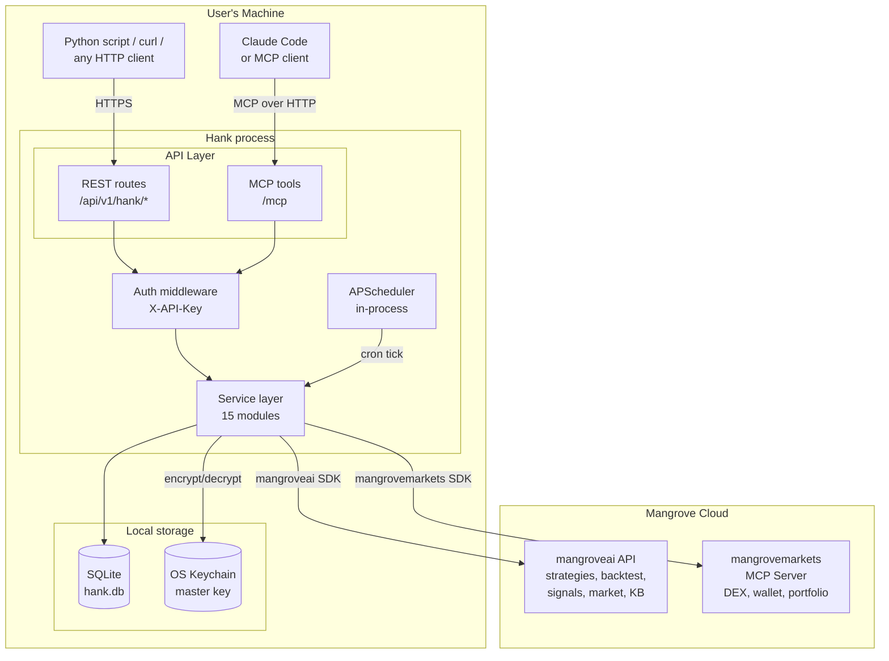
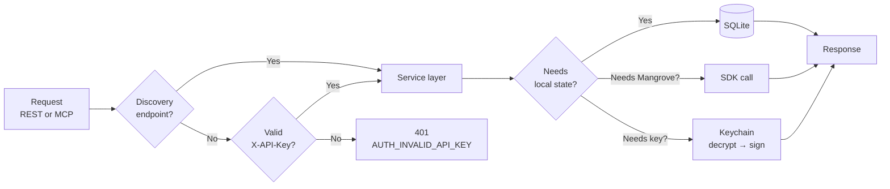
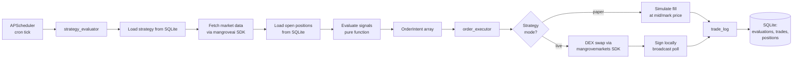
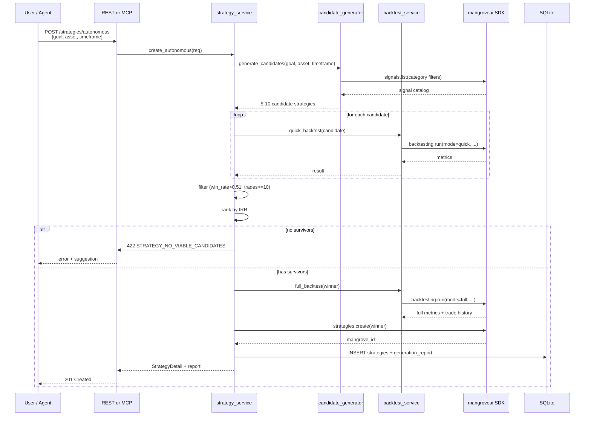
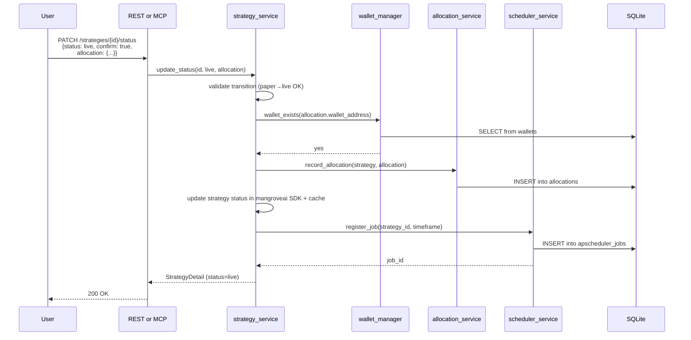
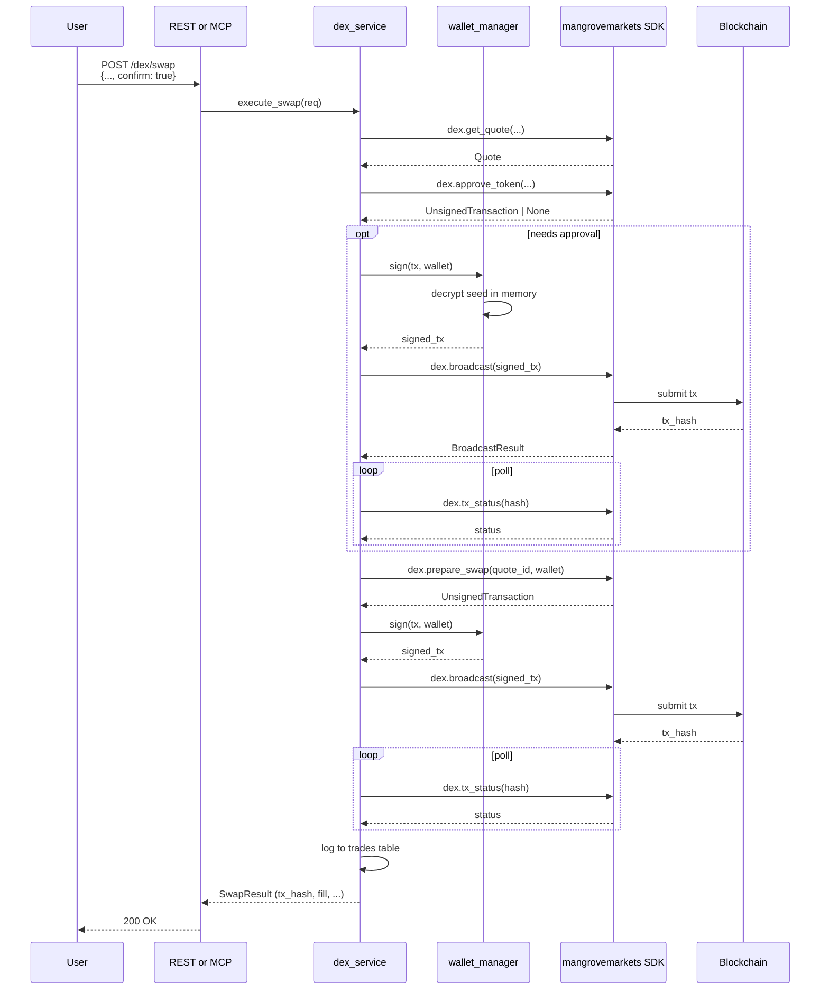
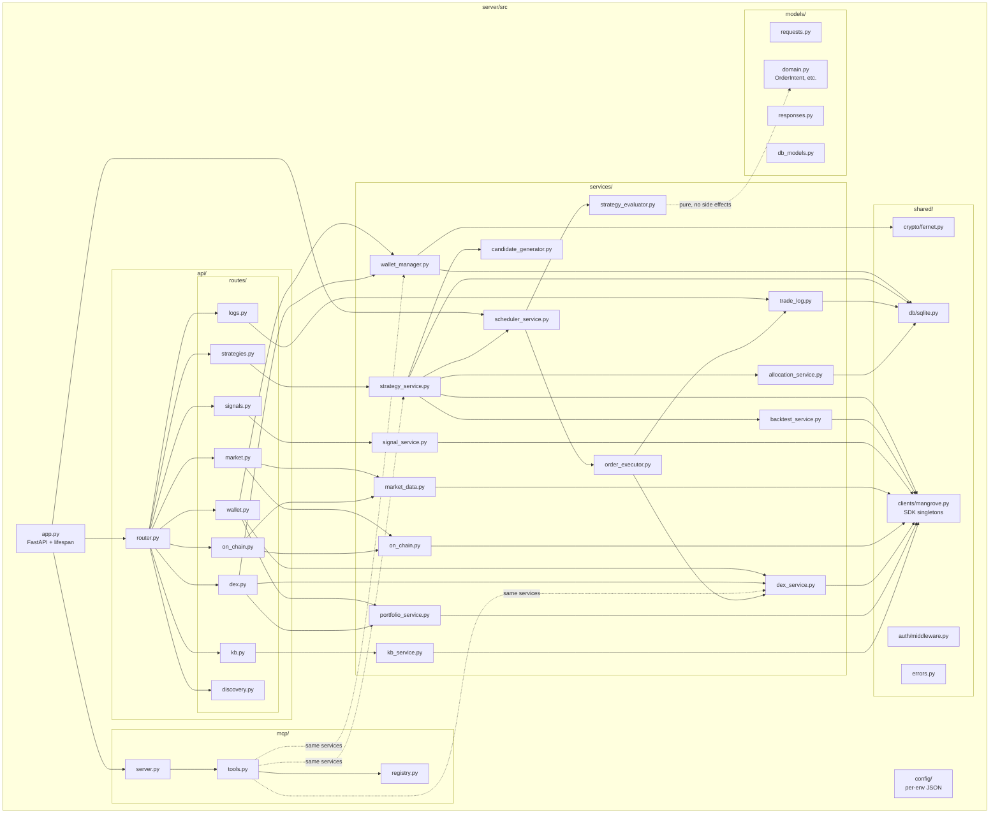
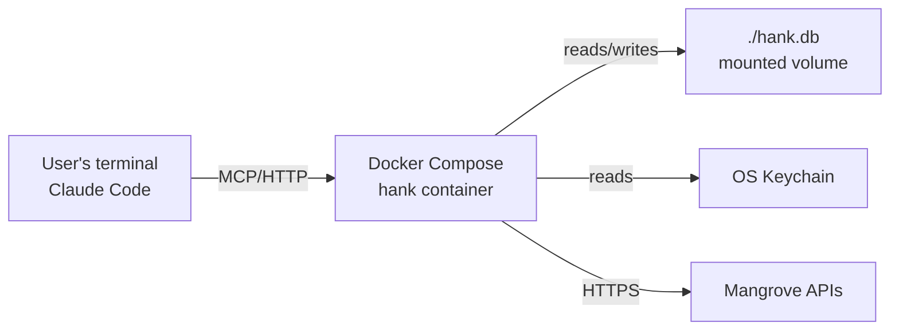
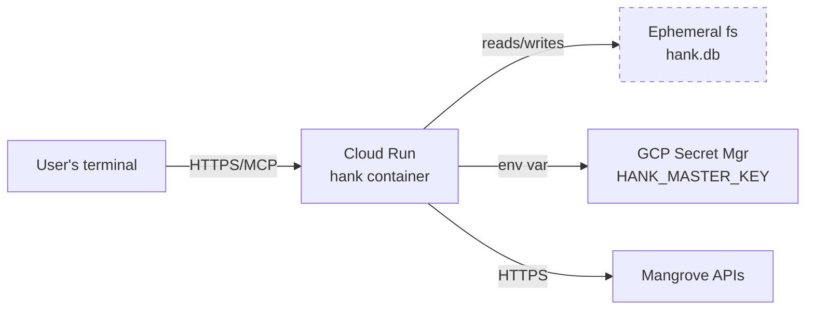

# Architecture: Hank (defi-agent)

**Generated:** 2026-04-17
**Status:** Draft
**Based on:** `docs/specification.md`

## Overview

Hank is a local-first FastAPI + MCP service that wraps two Mangrove SDKs, holds wallet keys on-disk (encrypted), and runs strategies on in-process cron jobs. The architecture is deliberately minimal:
- **One process.** FastAPI app serves REST + MCP + runs the scheduler in-process.
- **One datastore.** SQLite for everything — business data and the APScheduler jobstore share a DB file.
- **Two external dependencies.** `mangroveai` and `mangrovemarkets` SDKs. That's it.

No Postgres, no Redis, no x402, no message queues, no separate scheduler service. All removable complexity is removed.

---

## System Architecture



### Component responsibilities

| Component | Responsibility |
|-----------|---------------|
| REST routes | HTTP handlers under `/api/v1/hank/*`; delegate to service layer |
| MCP tools | FastMCP tool handlers at `/mcp`; delegate to service layer |
| Auth middleware | Validate `X-API-Key` against `HANK_API_KEY`; bypass for discovery |
| Service layer | All business logic; called by REST + MCP + scheduler |
| Scheduler | APScheduler BackgroundScheduler, SQLite jobstore |
| SQLite | Wallets (encrypted), strategies cache, allocations, evaluations, trades, positions, APScheduler jobs |
| OS Keychain | Stores the Fernet master key; env var `HANK_MASTER_KEY` is a fallback |

---

## Data Flow — Request Path



Auth is enforced once at the boundary. The service layer is protocol-agnostic — it doesn't know or care whether the caller came in via REST or MCP.

---

## Data Flow — Automated Evaluation Loop



`strategy_evaluator` is deliberately a pure function — no SDK calls, no DB writes, no network. That makes it trivially testable and swappable. All side effects live in `order_executor` and `trade_log`.

---

## Sequence — Autonomous Strategy Creation



Candidate generation uses **deterministic heuristics** — a rules table mapping goal keywords (momentum, mean_reversion, breakout, trend) to signal categories, with random sampling within each category for diversity. No LLM call from the server; the intelligence is in the mapping + the user's choice of goal language.

---

## Sequence — Strategy Activation (→ live)



From here, the scheduler fires independently — no user involvement until they deactivate.

---

## Sequence — DEX Swap (user-initiated)



The full 6-step flow, mediated entirely by Hank; the SDK never touches the private key. The key is decrypted in `wallet_manager.sign()` and zeroed from memory immediately after.

---

## Component Diagram — Server Internals



Key properties:
- **Routes never call SDKs directly.** Always through the service layer.
- **MCP tools and REST routes call the same services.** Logic lives in one place.
- **`strategy_evaluator` is pure.** No SDK calls, no DB writes — it takes data in and returns `OrderIntent[]`.
- **SDK clients are singletons** initialized at startup (`shared/clients/mangrove.py`), shared across services.

---

## Project Structure

```
app-in-a-box/
├── .claude/                                    # Development framework
│   ├── agents/
│   │   └── product-owner.md                    # Drives build after /plan
│   ├── hooks/
│   │   └── check-onboard.sh                    # SessionStart hook
│   ├── rules/
│   │   └── git-workflow.md
│   ├── skills/
│   │   ├── onboard/SKILL.md
│   │   ├── requirements/SKILL.md
│   │   ├── specification/SKILL.md
│   │   ├── architecture/SKILL.md
│   │   ├── plan/SKILL.md
│   │   └── tutorial/SKILL.md                   # Workshop curriculum
│   └── settings.json
├── server/
│   ├── src/
│   │   ├── app.py                              # FastAPI factory, scheduler lifespan
│   │   ├── config/
│   │   │   ├── local-config.json               # Defaults for local dev
│   │   │   ├── dev-config.json
│   │   │   ├── prod-config.json
│   │   │   └── loader.py                       # Env → config JSON selector
│   │   ├── api/
│   │   │   ├── router.py                       # Aggregates routes, mounts /api/v1/hank
│   │   │   └── routes/
│   │   │       ├── discovery.py                # health, status, tool catalog
│   │   │       ├── wallet.py                   # create, list, balances, portfolio, history
│   │   │       ├── dex.py                      # venues, pairs, quote, swap
│   │   │       ├── market.py                   # ohlcv, data, trending, global
│   │   │       ├── on_chain.py                 # smart_money, whale, holders
│   │   │       ├── signals.py                  # list, get
│   │   │       ├── strategies.py               # create, list, get, patch status, backtest, evaluate
│   │   │       ├── logs.py                     # evaluations, trades
│   │   │       └── kb.py                       # search, glossary
│   │   ├── mcp/
│   │   │   ├── server.py                       # FastMCP setup
│   │   │   ├── tools.py                        # Tool definitions (mirror REST)
│   │   │   └── registry.py                     # register_tool helper
│   │   ├── services/
│   │   │   ├── wallet_manager.py               # Key gen, Fernet encrypt, local signing
│   │   │   ├── strategy_service.py             # Strategy CRUD (wraps mangroveai)
│   │   │   ├── candidate_generator.py          # Goal → 5-10 signal combos
│   │   │   ├── backtest_service.py             # Quick + full, filter + IRR rank
│   │   │   ├── strategy_evaluator.py           # PURE: (strategy, mkt, pos) → OrderIntent[]
│   │   │   ├── order_executor.py               # OrderIntent → DEX (live) or simulated (paper)
│   │   │   ├── scheduler_service.py            # APScheduler wrapper
│   │   │   ├── trade_log.py                    # SQLite writes
│   │   │   ├── allocation_service.py           # Per-strategy fund accounting
│   │   │   ├── signal_service.py               # Wraps mangroveai.signals
│   │   │   ├── market_data.py                  # Wraps mangroveai.crypto_assets
│   │   │   ├── on_chain.py                     # Wraps mangroveai.on_chain
│   │   │   ├── dex_service.py                  # Wraps mangrovemarkets.dex
│   │   │   ├── portfolio_service.py            # Wraps mangrovemarkets.portfolio
│   │   │   └── kb_service.py                   # Wraps mangroveai.kb
│   │   ├── shared/
│   │   │   ├── auth/middleware.py              # X-API-Key validation
│   │   │   ├── db/
│   │   │   │   ├── sqlite.py                   # Connection helper, migrations
│   │   │   │   └── migrations/                 # SQL schema files
│   │   │   ├── crypto/
│   │   │   │   └── fernet.py                   # Master key mgmt + Fernet wrapper
│   │   │   ├── clients/
│   │   │   │   └── mangrove.py                 # SDK singletons
│   │   │   └── errors.py                       # Error codes, exception → HTTP mapping
│   │   ├── models/
│   │   │   ├── requests.py                     # Pydantic request models
│   │   │   ├── responses.py                    # Pydantic response models
│   │   │   ├── domain.py                       # OrderIntent, SignalRule, ExecutionConfig
│   │   │   └── db_models.py                    # Row adapters / ORM-lite
│   │   └── health.py                           # Health probe payload
│   ├── tests/
│   │   ├── conftest.py
│   │   ├── unit/                               # Pure unit tests (evaluator, candidate_gen)
│   │   ├── integration/                        # DB + SDK-mocked integration tests
│   │   └── e2e/                                # Full flow, uses dev Mangrove env
│   ├── db/
│   │   └── init.sql                            # Not used in v1 (SQLite auto-init)
│   ├── Dockerfile
│   └── requirements.txt
├── plugin/                                     # (Future) Claude Code plugin wrapper
├── tutorials/                                  # Workshop curriculum (separate deliverable)
│   └── bots-and-bytes/
├── docs/
│   ├── api-reference.md                        # Consolidated Mangrove API surface
│   ├── user-stories.md                         # Approved requirements
│   ├── specification.md                        # Approved spec
│   ├── architecture.md                         # This document
│   ├── implementation-plan.md                  # Generated by /plan
│   └── configuration.md
├── assets/                                     # Branding (kept as-is from template)
├── branding.json
├── docker-compose.yml                          # Local dev stack (app only, no postgres/redis)
├── .env.example                                # MANGROVE_API_KEY, HANK_API_KEY, etc.
├── init.sh                                     # Template init (kept)
├── CLAUDE.md
├── README.md
└── LICENSE
```

---

## Module Decisions

Based on Hank's architecture, here's what we keep from the app-in-a-box template and what we remove:

| Module | Status | Reason |
|--------|--------|--------|
| **FastAPI app factory** | ✅ Keep | Core of the dual-protocol service pattern |
| **MCP server (FastMCP)** | ✅ Keep | Core — AI agents prefer MCP |
| **REST routes** | ✅ Keep | Core — universal HTTP access |
| **API key auth middleware** | ✅ Keep | Single-user auth model |
| **Service layer pattern** | ✅ Keep | Shared business logic between REST + MCP |
| **Per-environment JSON config** | ✅ Keep | Matches local/dev/prod deployment modes |
| **SQLite (built-in)** | ✅ Keep | Single datastore for all state |
| **APScheduler** | ✅ Add (new) | In-process cron; not in template |
| **Fernet encryption + OS keychain** | ✅ Add (new) | Wallet key protection |
| **PostgreSQL** | ❌ Remove | SQLite suffices. No multi-user, no high concurrency. Remove `--profile full`, `db/init.sql` postgres schema, `notes.py` route. |
| **Redis** | ❌ Remove | No caching layer needed; APScheduler jobstore goes in SQLite. |
| **x402 payment middleware + routes** | ❌ Remove | Hank is a local bot, not a monetized service. Remove `shared/x402/`, `routes/easter_egg.py`. |
| **Items demo route** | ❌ Remove | Template scaffolding; replaced by real routes. |
| **Notes demo route** | ❌ Remove | Template scaffolding; replaced by real routes. |
| **Easter egg route** | ❌ Remove | x402 demo; Hank has no payment surface. |
| **Echo route** | ❌ Remove | Template scaffolding; no purpose in Hank. |
| **Terraform (GCP)** | 🟡 Optional | Keep for the optional Cloud Run demo path; not required for local use. Move to `infra/terraform/` and document as "demo only." |
| **Docker Compose (app-only profile)** | ✅ Keep | Primary local dev entry point. |
| **Docker Compose (full profile)** | ❌ Remove | Postgres + Redis not needed. |

---

## Technology Choices

| Layer | Choice | Alternatives considered | Rationale |
|-------|--------|-------------------------|-----------|
| Web framework | FastAPI | Flask, Starlette | Template default; great OpenAPI; async-native; plays well with FastMCP |
| MCP library | FastMCP | Raw MCP SDK | Template default; FastAPI-integrated; tool registration is a one-liner |
| Storage | SQLite | Postgres, DuckDB | Local-first means no external DB. Full ACID, WAL mode for concurrency, built into Python. |
| Scheduler | APScheduler (BackgroundScheduler, SQLAlchemy jobstore) | Celery, RQ, system cron | In-process, no broker required, persistent jobstore (survives restart), Python-native |
| Key encryption | Fernet (from `cryptography` lib) | age, nacl | Battle-tested, standard-compliant, simple API |
| Master key storage | OS Keychain via `keyring` | env var only, prompt per-session | Zero-config for local users; env var fallback for Cloud Run |
| Config | Per-env JSON + env var overrides | pydantic-settings | Template pattern; keeps secrets out of code |
| HTTP client (SDKs) | `httpx` (built into SDKs) | — | Chosen by upstream SDKs; not our decision |
| Test framework | pytest | unittest | Template default; fixtures are great |

---

## Deployment Architecture

### Local (default)



One `docker compose up` command; no cloud account required. State persists across restarts via bind-mounted volume.

### Cloud Run (optional, demo)



Wallet state and trade logs are wiped on each redeploy. Suitable for demo URLs; not for real trading.

### Not in v1

- Multi-region deployment
- Cloud SQL / persistent cloud storage
- Background worker pools (not needed — scheduler is in-process)
- Horizontal scaling (single-user means single-process is fine)
